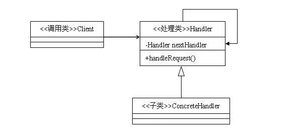

## Typescript 设计模式之职责链模式

### 一、简介

职责链模式是使多个对象都有机会处理请求，从而避免请求的发送者和接受者之间的耦合关系。在职责链模式里，很多对象由每一个对象对其下家的引用而连接起来形成一条链。请求在这个链上传递，直到链上的某一个对象决定处理此请求。

### 二、优缺点

#### 优点

- 降低耦合度。请求和处理是分开的，请求不用知道是谁处理，链中的对象也不需知道链的结构。
- 动态组合：增强了职责链组织的灵活性，可以在运行时动态改变职责链。

#### 缺点

- 不能保证请求一定被接收，请求可能得不到处理的情况。
- 请求从链头遍历到链尾，链太长或者每条链判断处理的时间太长会影响性能，特别是递归循环的时候。

### 三、应用场景

- 有多个对象可以处理一个请求，哪个对象处理该请求运行时自动确定，客户端只需要把请求提交到链上即可。
- 想在不明确指定接收者的情况下，向多个对象中的一个提交一个请求。
- 可处理一个请求的对象集合应被动态指定。

### 四、模式结构

职责链模式包含如下角色：

* 抽象处理类: 主要包含一个指向下一处理类的成员变量 nextHandler 和一个处理请求的方法 handRequest，handRequest 方法的主要思想是，如果满足处理的条件，则有本处理类来进行处理，否则由 nextHandler 来处理。
* 具体处理类：具体处理类的主要是对具体的处理逻辑和处理的适用条件进行实现。



### 五、实战

#### 具体实现

定义 Handler 类

```typescript
export class Handler {
    private handler: Handler;
    private req: number;

    constructor(req: number) {
      this.req = req;
    }

    public setHandler(handler: Handler): void {
      this.handler = handler;
    }

    public operation(msg: string, req: number): void {
      if (req <= this.req) {
        this.handlerRequest(msg);
      } else if (this.handler !== null && this.handler !== undefined) {
        this.handler.operation(msg, req);
      }
    }

    public handlerRequest(msg: string): void {
      throw new Error("Abstract method!");
    }
  }
```

定义 ConcreteHandler1、ConcreteHandler2 及 ConcreteHandler3

```typescript
export class ConcreteHandler1 extends Handler {
    constructor(req: number) {
      super(req);
    }
    public handlerRequest(msg: string) {
      console.log("Message (ConcreteHandler1) :: ", msg);
    }
}

export class ConcreteHandler2 extends Handler {
    constructor(req: number) {
      super(req);
    }
    public handlerRequest(msg: string) {
      console.log("Message :: (ConcreteHandler2) ", msg);
    }
}

export class ConcreteHandler3 extends Handler {
    constructor(req: number) {
      super(req);
    }
    public handlerRequest(msg: string) {
      console.log("Message :: (ConcreteHandler3) ", msg);
    }
}
```

#### 使用示例

```typescript
export function show(): void {
      var h1: ChainOfResponsibilityPattern.Handler,
        h2: ChainOfResponsibilityPattern.Handler,
        h3: ChainOfResponsibilityPattern.Handler,
        reqs: number[],
        i: number,
        max: number;

      reqs = [2, 7, 23, 34, 4, 5, 8, 3];

      h1 = new ChainOfResponsibilityPattern.ConcreteHandler1(3);
      h2 = new ChainOfResponsibilityPattern.ConcreteHandler2(7);
      h3 = new ChainOfResponsibilityPattern.ConcreteHandler3(20);

      h1.setHandler(h2);
      h2.setHandler(h3);

      for (i = 0, max = reqs.length; i < max; i += 1) {
        h1.operation("operation is fired!", reqs[i]);
      }
    }
  }
```

