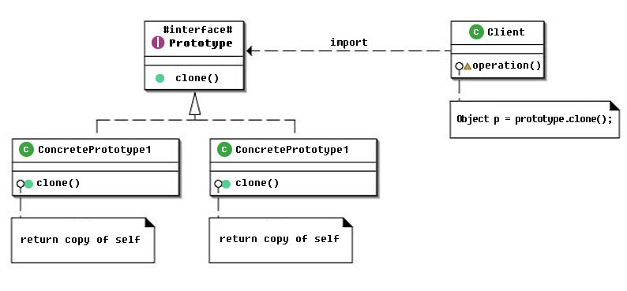
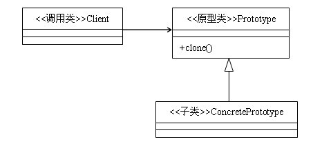

## Typescript 设计模式之原型模式

### 一、简介
原型模式是指用原型实例指向创建对象的种类，并通过拷贝这些原型创建新的对象。

原理图:



简单UML:



### 二、优缺点

#### 优点

- 简化对象的创建，减少子类的构造

- 原型模式创建对象比直接new一个对象性能好。因为Object类的clone方法是直接操作内存中二进制流的本地方法，尤其在复制大对象时，性能优势明显

#### 缺点

- Object类的clone方法只会进行浅拷贝。如果要实现深拷贝，必须将原型模式中的数组、容器对象、引用对象等另行拷贝

### 三、应用场景

* 需要重复地创建相似对象时可以考虑使用原型模式。如：需要在一个循环体内创建对象，假如对象创建过程比较复杂或者循环次数很多的话，使用原型模式不但可以简化创建过程，而且可以使系统的整体性能提高很多。

### 四、实战

#### 具体实现

Prototype 接口

```typescript
export interface Prototype {
  clone(): Prototype;
  toString(): string;
}
```

Concrete

```typescript
export class Concrete implements Prototype {

      clone() : Prototype {
          return new Concrete();  // 返回自身实例
      }

      toString(): string {
          return "This is Concrete";
      }
  }
```

Builder

```typescript
export class Builder {
      private prototypeMap: { [s: string]: Prototype; } = {};

      constructor() {
          this.prototypeMap['c1'] = new Concrete();
      }

      createOne(s: string): Prototype {
          return this.prototypeMap[s].clone();  //拷贝原型创建新对象
      }
  }
```

#### 使用示例

```typescript
  export function show() : void {
    var builder : PrototypePattern.Builder = new PrototypePattern.Builder();
    var i = 0;
      for (i = 1; i <= 3; i += 1) {
          console.log(builder.createOne("c" + i).toString());
      }
  }
```
